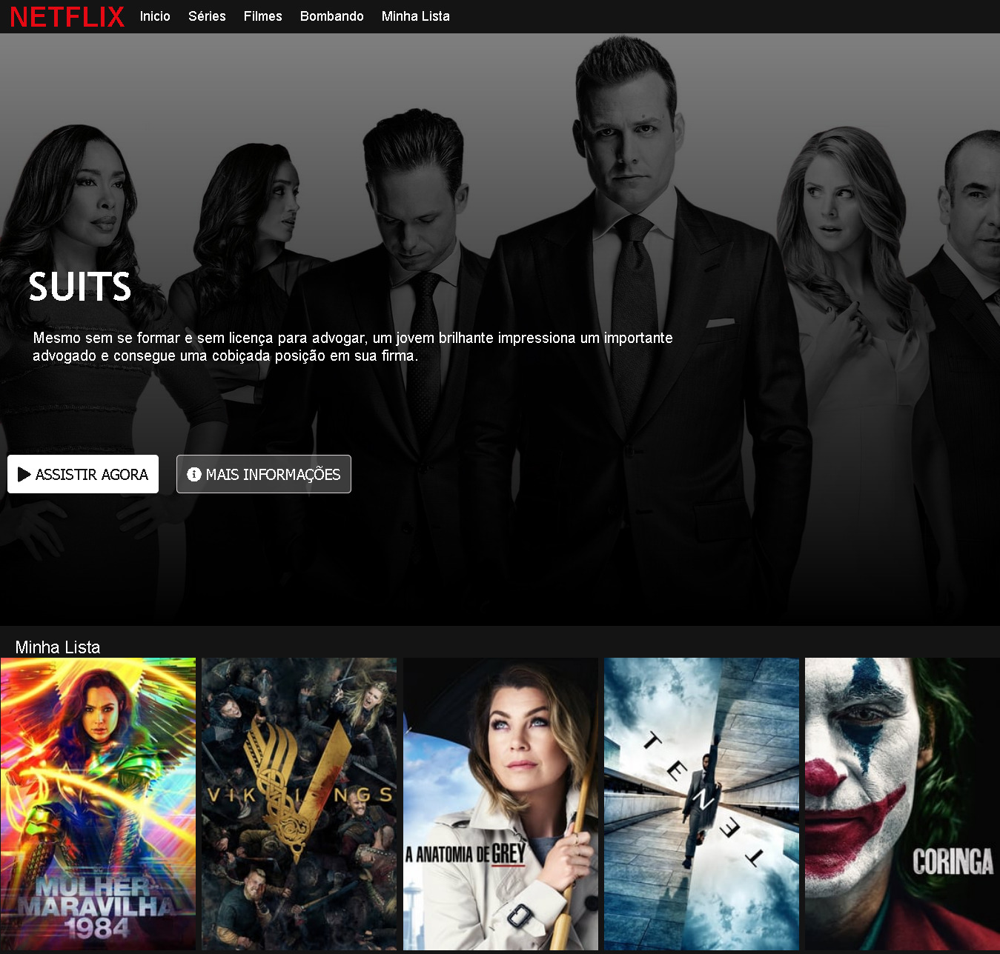

# clone-interface-netflix
Aprendendo a recriar a homepage da Netflix.  Projeto DIO

<h1 align="center">
Projeto DIO - NETFLIX HOMEPAGE
</h1>

<a href="https://www.netflix.com/br/">Neflix Homepage</a> for study purposes.

[Sammynauta](https://github.com/Sammynauta)

## Resources

- [x] HTML, CSS, JAVASCRIPT.
- [x] Images (JPEG, PNG)
